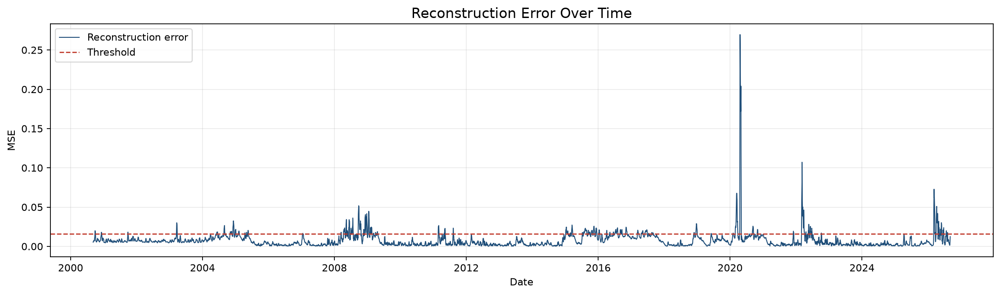

# WTI Crude Oil Price Anomaly Detection

An LSTM autoencoder for daily West Texas Intermediate futures (`CL=F`).

The network is trained to reconstruct ten-day windows of scaled closing prices. It never sees event labels. A day is marked anomalous when its reconstruction error (mean squared error over the window) exceeds the 90th percentile of the error observed in training. That rule is enough to recover several well-known stress periods — including 20 April 2020, when WTI settled at −$37.63 — from the price path alone.

Data are downloaded from Yahoo Finance. Training, scoring and figures are driven from the command line; outputs land in `output_results/`. Optional weekly fine-tuning can publish a new model to the Hugging Face Hub only if hold-out error does not deteriorate beyond a fixed margin.

Further reading: [DOCUMENTATION.md](DOCUMENTATION.md) (modules and workflow), [PLAYBOOK.md](PLAYBOOK.md) (GitHub and Hub).

## Results

Closing price with days above the error threshold:


Reconstruction error over time, with the decision threshold:



Fitted model (up to 100 epochs, early stopping at 34; scores through 4 September 2026):

| Metric | Value |
| --- | --- |
| Windows scored | 6,528 |
| Days above threshold (P90 MSE) | 623 (9.5%) |
| Training MAE / hold-out MAE | 0.072 / 0.055 |
| Best validation loss | 0.0060 |
| Threshold | 0.0162 |
| Largest reconstruction error | 20 April 2020, close −$37.63, MSE 0.270 |

Hold-out MAE is lower than training MAE, which is consistent with a model that generalises rather than memorises the training windows.

## Architecture

Unadjusted daily closes are scaled with `RobustScaler` (appropriate for heavy tails and the negative 2020 print) and arranged as tensors of shape `(n, 10, 1)`.

```
Input (batch, 10, 1)
  → LSTM 64 + Dropout 0.25
  → LSTM 32 + Dropout 0.25          # latent bottleneck
  → RepeatVector(10)
  → LSTM 32 + Dropout 0.25
  → LSTM 64 + Dropout 0.25
  → TimeDistributed Dense(1)
```

The loss is reconstruction MSE. The scaler is fitted on the training split only and is left unchanged during later fine-tuning, so the feature space remains fixed.

## Project structure

```
config.yaml                      ticker, lookback, epochs, Hub id
requirements.txt
DOCUMENTATION.md
src/
  config.py
  data_loader.py
  preprocessor.py
  model.py
  plots.py
  pipeline.py                    train | retrain | evaluate
output_results/                  model, scores, figures
```

## Setup

Python 3.11 or later.

```bash
python3 -m venv .venv
source .venv/bin/activate
pip install -r requirements.txt
```

Versions known to import cleanly: NumPy 1.26, SciPy 1.14, TensorFlow 2.16.

## Usage

Train on the full `CL=F` history (writes the model, CSVs and figures; skips Hugging Face):

```bash
python src/pipeline.py --mode train --skip-upload
```

Score the saved model and refresh reports without training:

```bash
python src/pipeline.py --mode evaluate
```

Fine-tune on recent data. The current model is scored on a hold-out window, a candidate is trained for a few epochs, and the candidate is kept only if hold-out MAE does not rise by more than 10%:

```bash
python src/pipeline.py --mode retrain
```

If no saved model is present, `retrain` starts a full `train` run.

## Configuration

Runtime settings live in `config.yaml`: ticker (`CL=F`), lookback (10), scaler (`robust`), batch size, training versus fine-tune epochs, threshold percentile, Hugging Face `repo_id`, and filenames under `output_results/`.

```yaml
huggingface:
  repo_id: "DrAdrianDC/wti-lstm-autoencoder"
```

## Operations

A GitHub Actions workflow can run `python src/pipeline.py --mode retrain` on Sundays at 00:00 UTC. WTI adds one trading bar per session, so a daily retrain would add noise rather than information. Set the `HF_TOKEN` secret to publish; if it is absent, training still finishes and the job remains green. If the hold-out check fails, the previous model is left unchanged.

## Data

Prices come from [yfinance](https://github.com/ranaroussi/yfinance) (`CL=F`, period `max`, unadjusted close). The loader retries transient Yahoo failures and rejects series whose Close null ratio exceeds the configured limit.

## License

MIT. See [LICENSE](LICENSE).
